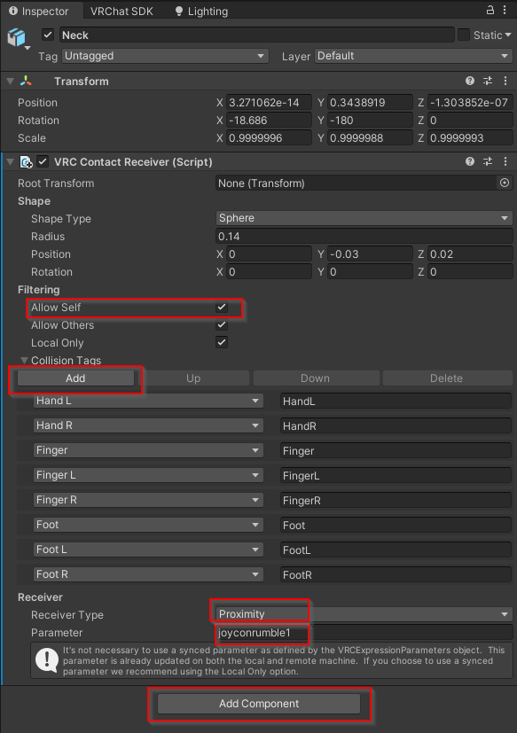

# VRCJoyCon

Link Nintendo Switch Joy-Cons to VRChat! Uses the new [OSC system](https://docs.vrchat.com/docs/osc-overview). 

For now, only simple on/off rumble haptics are supported!

# Requirements

 - Nintendo Switch Joy-Con controller(s). **Only tested with knockoffs from Aliexpress.**
 - A customisable avatar or a compatible avatar
 - Bluetooth Dongle or similar. [You can use another Windows device as relay](#relay)
 - Something to attach controller to body/headset straps, for example ["Exercise Patch Self Adhesive Tape Sports Gym Fitness"](https://www.google.com/search?q=Exercise+Patch+Self+Adhesive+Tape+Sports+Gym+Fitness)
 - Unity editor
 - `vrcjoycon.exe` from this repository's [Releases](https://github.com/Python1320/vrcjoycon/releases/tag/vrcjoycon)

# HELP WANTED
Only tested with knockoff joycons. Does it work with real joycons?

# TODO
 - Example haptics avatar world
 - Button input possibility
 - Gyroscope?
 - Switch joy-con to poll only to reduce wireless interference

# Haptics: Setting Up / Usage

**Unity**
  1. Position one or multiple [Contact Receivers](https://docs.vrchat.com/docs/contacts#vrccontactreceiver) components to your chosen avatar bone
     1. Choose at least some collision tags or you will receive no contacts 
     2. Haptics can be set to `local only`. `Allow Self` is recommended for testing.
     3. Select `Proximity` from `Receiver Type`.
     4. Set target parameter to `joyconrumble1`. For right controller choose `joyconrumble2`. 

        
     5. Add the above parameters to your [animator parameters](https://docs.vrchat.com/docs/animator-parameters) with default float value of 0.0. This is used by OSC to relay the status to VRCJoyCon.
        
        

**VRChat**
  1. Put controllers into pairing mode by pressing the pairing button.
  2. Pair controllers manually over Bluetooth with Windows.
  3. Launch [vrcjoycon.exe](https://github.com/Python1320/vrcjoycon/releases/tag/vrcjoycon)
  4. When pairing is successful, the controller should vibrate. You may need to press the pair button in the controllers a few times before Windows notices the controllers. They should say "connected" in the windows settings when this is so.
  5. In case of trouble, test with other joycon software first
  6. Launch **VRChat** if not already launched
     1. From the VRChat's **circular menu**, inside **settings**, inside **OSC**, choose **Enable** OSC. Additional help [here](https://docs.vrchat.com/docs/osc-overview#enabling-it).
      (*If the haptics do not work, try reset configuration option in the same menu* **ATTN.** The OSC Debug menu does not help you with debugging haptics, only output)

# Relay
If you have no bluetooth on your VR PC or are experiencing interference it should also be possible to use `vrcjoycon.exe` on a different Windows Laptop, for example.

 1. You will need to configure VRChat to relay the OSC output data to your target computer: https://docs.vrchat.com/docs/osc-overview#vrchat-ports
 2. Start `vrcjoycon` with command line arguments `vrcjoycon.exe --listen=any --port=9001`
       - You can replace `any` with an IP address. Any is an alias for `0.0.0.0`
       - The default port is 9001
       - Make sure your firewall allows listening on `UDP` protocol port `9001` for `vrcjoycon.exe`

# Troubleshooting

Test with OSC receiver to see if your avatar is transmitting. Try transmitting `1` to `/avatar/parameters/joyconrumble1` with OSC sender to see if `vrcjoycon.exe` works.

# Credits / components used
 - [joycon-python](https://github.com/tocoteron/joycon-python) library

# License

PENDING MISSING LICENSE ON: https://github.com/tocoteron/joycon-python

